# Managing AWS Lambda Using REST API :hand:fa18-516-08

| Varun Joshi
| vajoshi@iu.edu
| Indiana University
| hid: fa18-516-08
| github: [:cloud:](https://github.com/cloudmesh-community/fa18-516-08/blob/master/project-report/report.md)

**:mortar_board: Learning Objectives**

* Understand RESTful APIs and explore basic CRUD operations
* Apply REST understanding to Amazon's FaaS offering - AWS Lambda
* Learn AWS SDK for Python - boto3
* Use boto3 and Python Flask framework for building RESTful API with AWS Lambda as the resource

---

Keywords: FaaS, AWS Lambda,serverless,REST,OpenAPI example,Swagger

---

## Abstract

Amazon's Function as Service offering, AWS Lambda, provides serverless computing and eliminates the overhead of provisioning and managing servers.
AWS Lambda can also integrate with other AWS services like S3 and Dynamo DB, extending it's capabilities for building highly scalable applications. AWS Lambda can be triggered by other AWS resource events, HTTP endpoints, mobile applications etc. giving the flexibility for serverless computing. This project explores managing AWS Lambda by providing a solution for basic CRUD operations through REST API build using OpenAPI (Swagger 2.0) specification.

## Introduction

The goal of this project is to build a solution utilizing REST APIs to manage AWS Lambda service. The solution focuses on providing basic REST CRUD operations with AWS Lambda as resource. Python and Python flask framework is used for constructing REST service and AWS SDK for Python (boto3) is used for managing AWS Lambda.

## Architecture

The project is build of three components (see +@fig:Architecture).

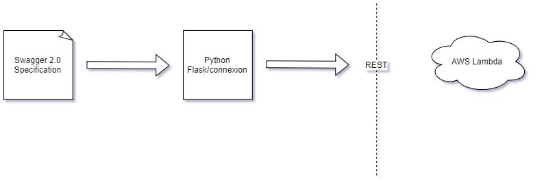{#fig:Architecture}

* Swagger 2.0 is used for writing API specification.The specification describes endpoints for AWS Lambda CRUD operations and defines operation for each endpoint.
* Python flask framework consumes the OpenAPI specification and directs the endpoints to Python functions by building a RESTful app.
* AWS SDK for Python (boto3) is used to define Python functions which operate on endpoints and expose the resource, which is AWS Lambda , over REST API.

## Implementation

Refer to the architecture (see +@fig:Architecture). I have enhanced the figure to include implementation details (see +@fig:Implementation).

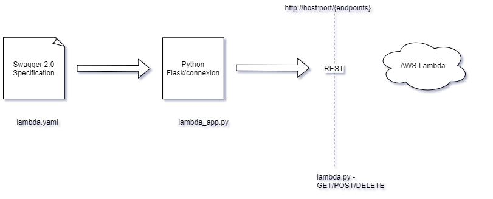{#fig:Implementation}

* **OpenAPI specification (Swagger 2.0)** :
  - **/project-code/lambda.yaml** : Defines the endpoints for CRUD operations on AWS lambda
* **Python flask framework** :
  - **/project-code/lambda_app.py** : Creates a connexion app which uses Flask under the hood. Consumes OpenAPI specification (Swagger 2.0) file lambda.yaml and routes the endpoints defined in the specification to the respective Python functions.The app is exposed as REST API running on local host and port 8080.
* **Python program for building endpoints** :
  - **/project-code/lambda.py** : Defines multiple Python functions utilizing boto3 which is AWS SDK for Python. Each function builds the endpoints to support REST operations.
* **Other files** :
  - **/project-code/create_lambda_basic_exec_role.py** : This Python program generates a basic AWS Lambda execution role which is attached to the newly created AWS Lambda function. To create an AWS Lambda function with an enhanced role such as accessing, the policy attribute in the program can be changed to the desired policy.
  - **/project-code/config.yaml** : This is a Python configuration file in YAML format. It holds reusable variables used across the Python programs in this project.
  - **/project-code/requirements.txt** : File with Python package and libraries dependency to be installed using pip command.
  - **/project-code/test/hello.zip** : Sample AWS Lambda deployment package zip file which holds a Python program for building simple AWS Lambda Function as a Service.
  - **/project-code/test/fun.json** : Body parameters for REST POST operation for creating AWS Lambda. The body parameter consumes json content. The format is:
          {
        "cfile": "hello.py",
        "handler": "lambda_handler",
        "pkg": "hello.zip",
        "renv": "python3.7"
        }
    The key values are required and are explained as below:
      - **"cfile"** : The  name of the code file for the application which is used by AWS Lambda for processing the functionality of the application. This project uses simple Hello World Python program as the code file.
      - **"handler"** : Name of the handler or function inside the code file which is invoked by AWS Lambda. In this project lambda_handler is the name of the Python function inside the code file hello.py.
      - **"pkg"** : The name of the zip file which has code file as well as all dependencies required for the code file. In this project this zip file is physically present in the directory /project-code/test.
      - **"renv"** : Runtime environment in AWS Lambda for the code file. This project uses Python 3.7 runtime environment provided by AWS Lambda.

  - **/project-code/shell**:
    - setup.sh : sets the project environment by cloning this GIT repository
    - runAPI.sh : Runs the /project-code/lambda_app.py to start REST service
    - testAPI.sh : basic GET/POST/DELETE curl commands to test REST service for managing AWS Lambda
    - clean.sh : Deletes the project environment

## Testing and Results

In the /project-code directory, run the Python program lambda_app.py:
python lambda_app.py

REST service will start on port 8080 (see +@fig:start REST)

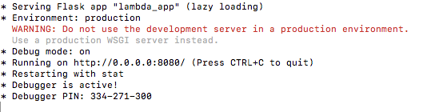{#fig:startREST}

Once the REST service has started , bring up the Swagger UI (see +@fig: SwaggerUI).curl can also be used in the command line to test the REST service)

Type http://0.0.0.0:8080/lambda/ui/ on a web browser to open Swagger UI:

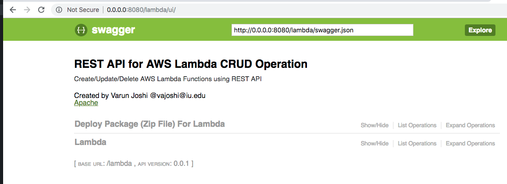{#fig:SwaggerUI}

For the LAMBDA tag in the Swagger UI, click "List Operations". All available REST operations for AWS Lambda resource will be displayed (see +@fig:Lambda).

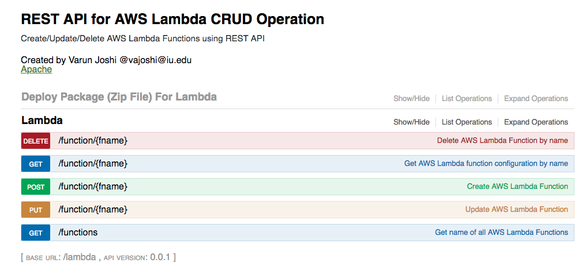{#fig:Lambda}

Test each operation:
* **GET all AWS Lambda functions**:
Click on GET /function in the Swagger UI and then click "Try it out!" (see +@fig:GETFunctions).

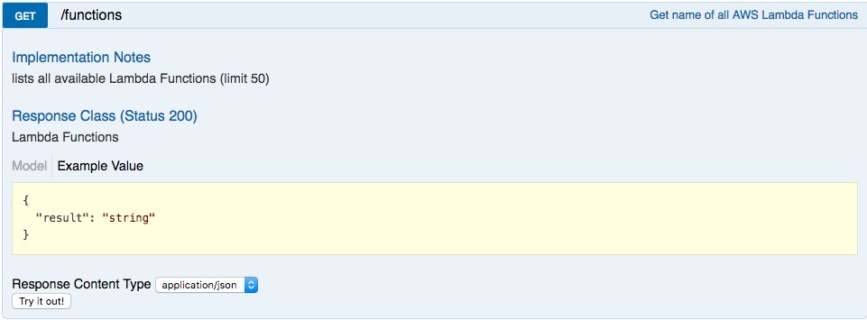{#fig:GETFunctions}

Result for GET functions (see +@fig:GETFunctionsResult).

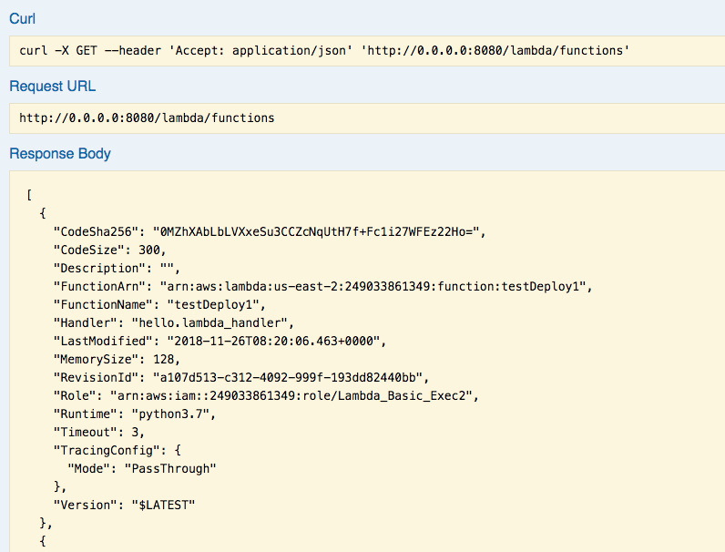{#fig: GETFunctionsResult}

* **GET function by name**:
Click on GET /function/{fname} in the Swagger UI and then type the function name to get and click "Try it out!" (see +@fig: GETFunctionByName).

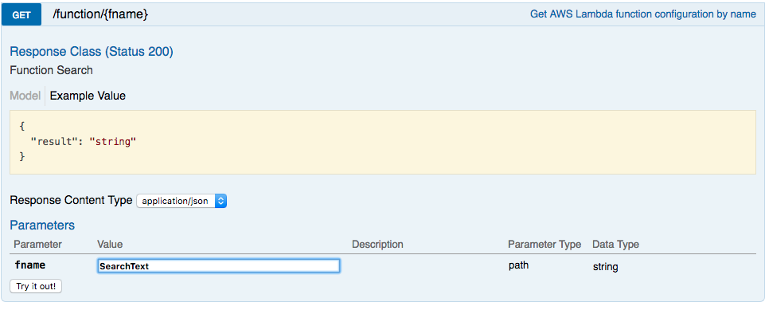{#fig:GETFunctionByName}

Result for GET function by name (see +@fig:GETfunctionresult).

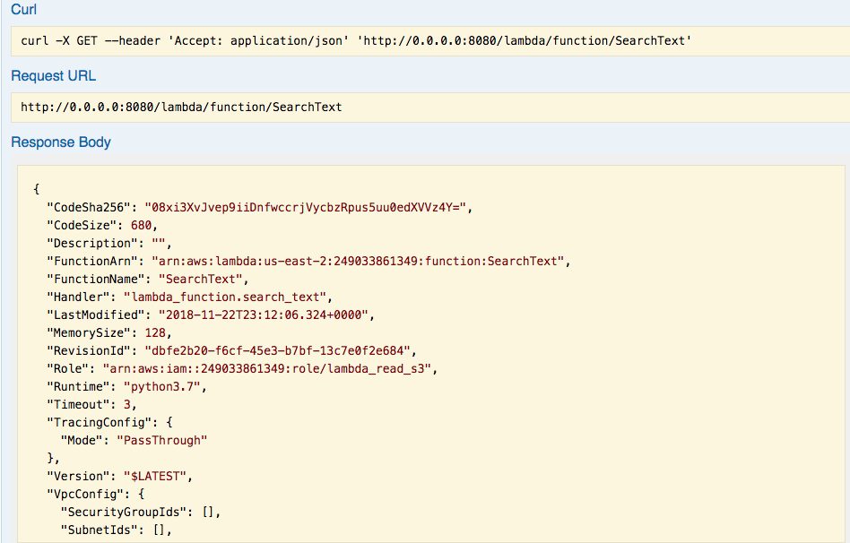{#fig:GETfunctionresult}

* **POST a new function**:
Expand POST /function/{fname} , type in the new AWS Lambda function name to create and in the body parameter type in the json format for the required values or click the json under "Example Value" to auto pouplate the json in the body parameter. Click "Try it out!" (see +@fig:POSTfunction).

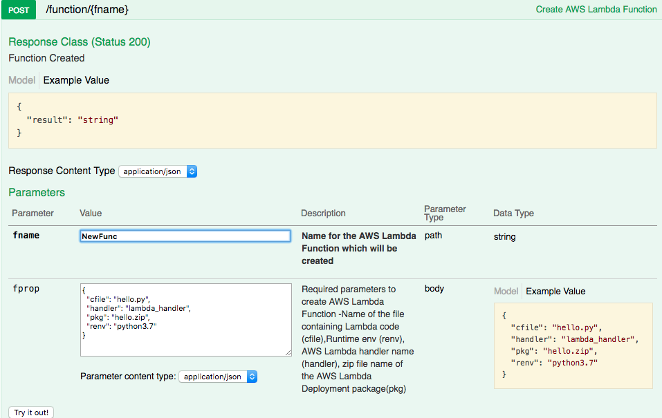{#fig:POSTfunction}

Result for POST function (see +@fig:POSTResult).

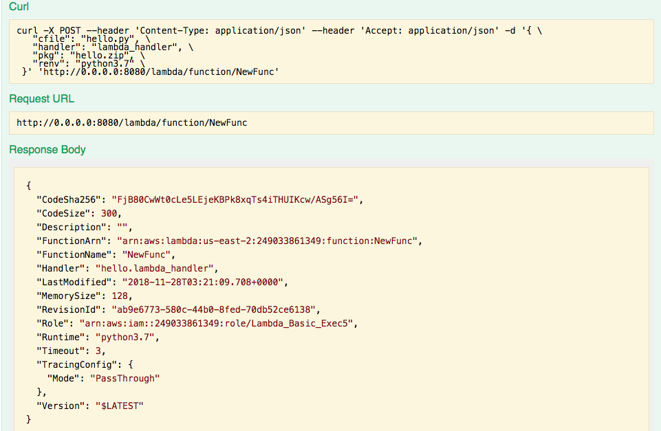{#fig:POSTResult}

* **Delete a function**:
Expand DELETE /function/{fname} in the Swagger UI. Type in the function name to delete and then click "Try it out!" (see +@fig:DELETEfunction).

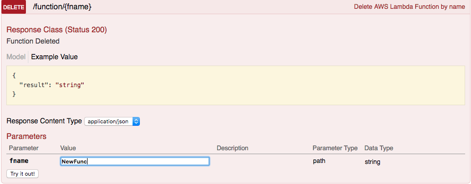{#fig:DELETEfunction}

Result for DELETE function (see +@fig:DELETEresult).

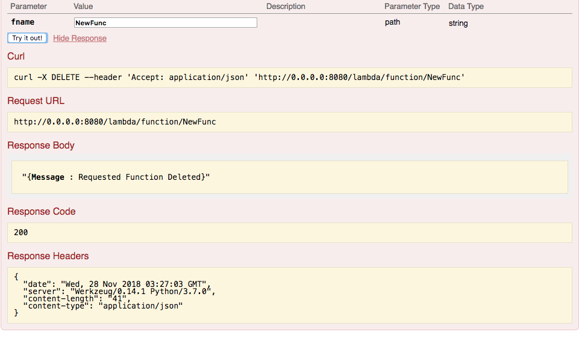{#fig:DELETEresult}

## Steps To Reproduce

To reproduce the project environment in any Ubuntu machine, use the
**/project-code/shell/setup.sh**

The setup.sh has following commands:

* git clone https://github.com/cloudmesh-community/fa18-516-08
* cd fa18-516-08/project-code
* sudo pip install -r requirements.txt

Then, open config.yaml to update your AWS access key id and AWS secret access key for the user id which has permission to create AWS services and resources.

To start REST service use **/project-code/shell/runAPI.sh**

* sudo python lambda_app.py

Commands to test REST are provided in **/project-code/shell/testAPI.sh**

## Technologies Used

* **OS** : ubuntu 18.04
  - For project runtime environment and to host REST service.
* **Programming Language** : Python 3.7
  - For building REST service using Flask framework with connexion
  - Building functions for REST endpoints
* **Cloud Provider** : Amazon Web services
  - For exposing AWS Lambda, Amazon's FaaS offering , as REST endpoint for CRUD
  - boto3 - AWS SDK for Python
* **API Specification** : OpenAPI
  - Swagger 2.0 specification for building REST API
  - Swagger UI editor for testing REST operations

## Conclusion

## Acknowledgement
