# Google Cloud Functions :smiley: fa18-516-08

| Varun Joshi
| vajoshi@iu.edu
| Indiana University
| hid: fa18-516-08
| github: [:cloud:](https://github.com/cloudmesh-community/fa18-516-08/blob/master/section/GCPFunctions.md)

* __Learning Objectives__

  * Gentle introduction to Google Cloud Function
  * Practical example using console mode

* __Introduction__

Google Cloud Function is Google's offering for Function as a Service. It enables serverless computing and offers functions as services on Google Cloud Platform driven by trigger events from Cloud Pub/Sub, Cloud Storage, HTTP or changes in log in Stackdriver logging. Cloud functions can also be invoked for real time mobile changes.
Google Cloud page on cloud functions [https://cloud.google.com/functions/use-cases/] gives more detail about the use cases such as Serverless application  backends, Real-time data processing, Intelligent applications - all without the need of provisioning a server instance or the overhead of managing a server instance. The functions are invoked as services whenever needed for a business requirement and the cost is billed as per the minutes of usage just for the function execution time. The Google Cloud Functions can be written in Node.js or Python. For Python runtime environment refer to the page
 [https://cloud.google.com/functions/docs/concepts/python-runtime]

For Node.js 6 runtime environment refer to the page

[https://cloud.google.com/functions/docs/concepts/nodejs-6-runtime]

For Node.js 8 runtime environment refer to the page

[https://cloud.google.com/functions/docs/concepts/nodejs-8-runtime]

* __Google Cloud Function Example__

Following from the example as presented in AWS Lambda section, we will look into a simple example of building a Google Cloud Function to check if a string is Palindrome or not.
The implementation will be in Python and we will use Python runtime environment. We will use HTTP trigger to invoke the function using HTTP request. We will also use the Google Cloud Console to build, deploy and test the function. Finally we will use HTTP url to send request to the function to get the result of our query.

Let's begin:

__Step 1__ : Login to Google Cloud Platform with your GCP account. We are using free tier for this demonstration. Refer to the section for Google Cloud in the epub for creting a free tier GCP account.

__Step 2__ : Select or create a Project and go to dashboard

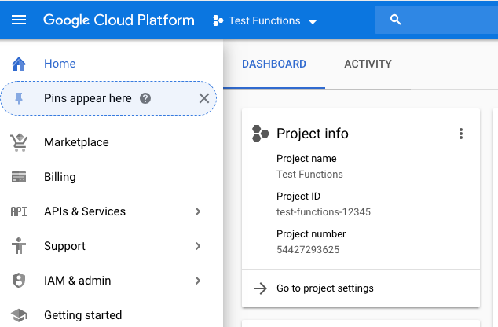

__Step 3__ : Click "Create a Cloud Function"

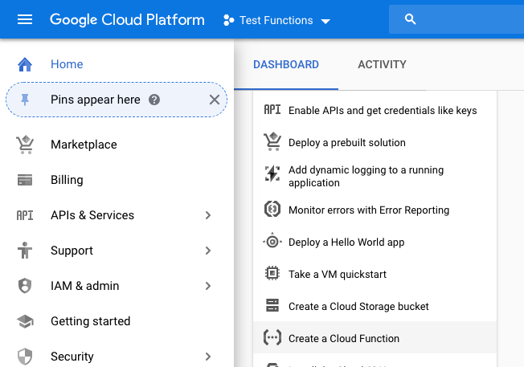

__Step 4__ : Enable cloud function API if it is not enabled:

__Step 5__ : Click Create Function

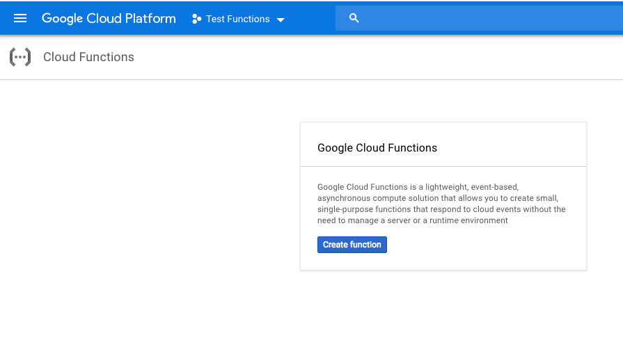

__Step 6__ : In the next page, give a name to the function. In our case we are giving function name as isPalindrome. Specify the memory (128 mb is good for this demo). Select the function trigger as HTTP. Choose inline editor for the source code and finally Python 3.7 as the run time environment.

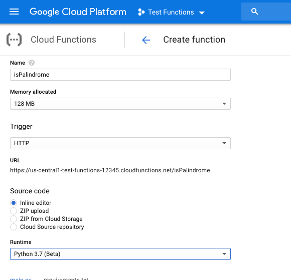

__Step 7__ : In the inline source editor, write a Python function and then click Create. We have written a Python function to check for Palindrome string. NOTE: This is not an optimized Python code, it's just used here for demonstration purpose. This function can be optimized further with Python standards style writing.

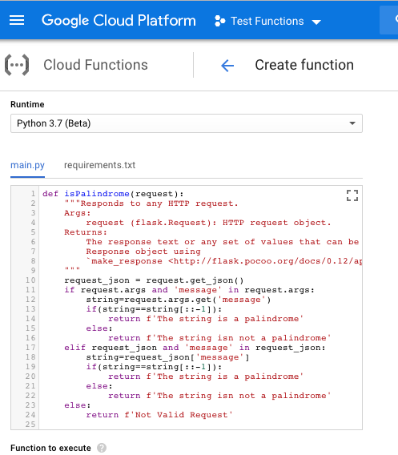

__Step 8__ : The function is created and deployed in the next page.

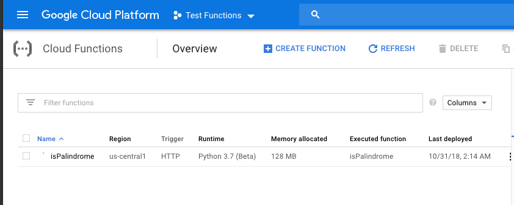

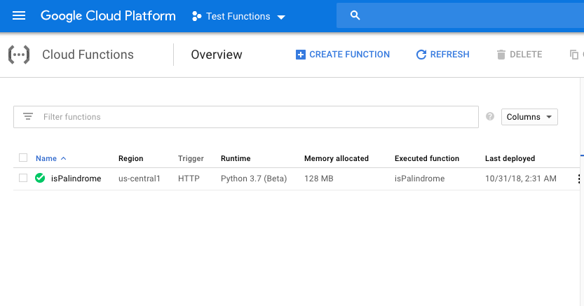

__Step 9__ : Finally we will test the function

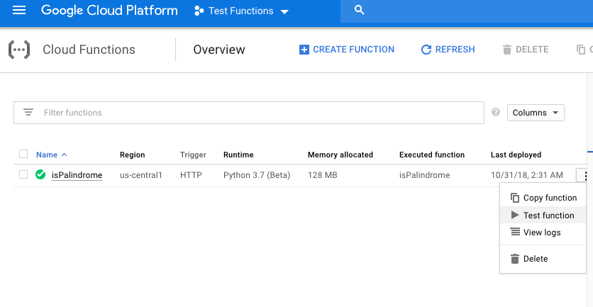

__Step 10__ : In the Trigger event box, write a HTTP message request in JSON format and click Test the Function

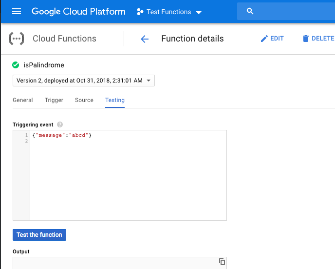

__Step 11__ : The response box will show the result of the test as expected

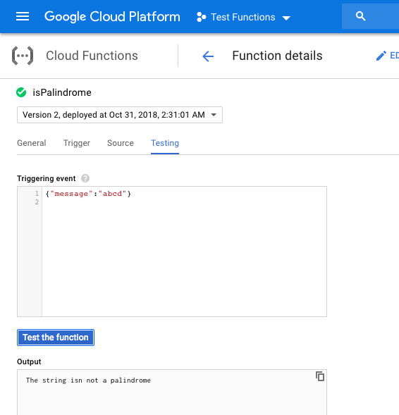

__Step 12__ : Let's run one more Test

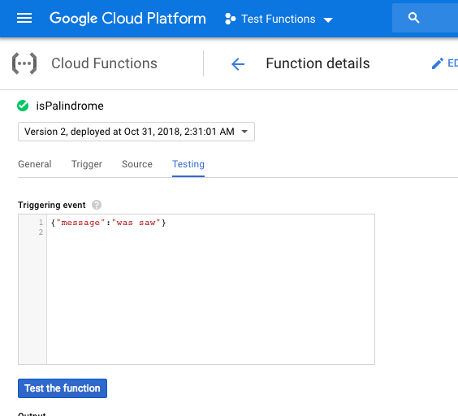

__Step 13__ : You will get the expected result

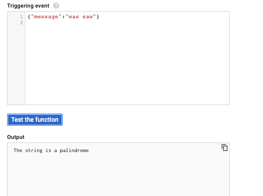

__Step 14__ : Let's test our function deployment using url. Click on the function name

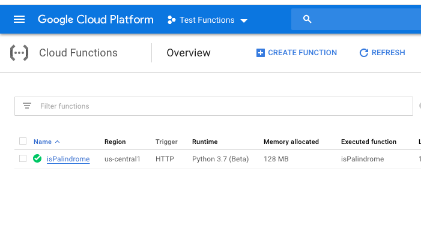

__Step 15__ : In the next page, click on Trigger page and copy the url

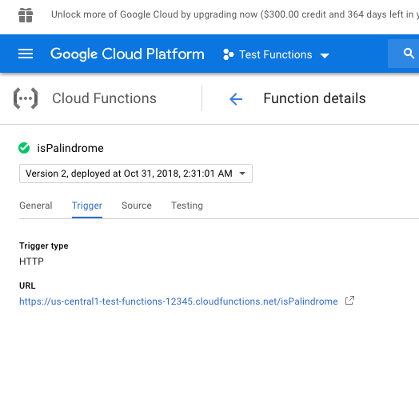

__Step 16__ : In a web browser type the url and add the HTTP request to it and hit enter

[https://us-central1-test-functions-12345.cloudfunctions.net/isPalindrome?message=abcd]

__Step 17__ : You will get a response back from the function

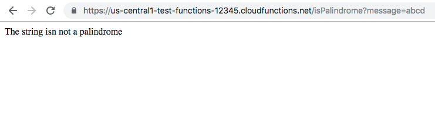

__Step 18__ : Another test

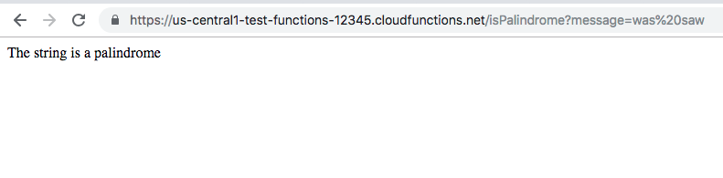

This completes our demo for Google Cloud Function offered as Function as Service. To learn more about Google Cloud Functions and trigger options available alongwith triggers using command line - visit
[https://cloud.google.com/functions/]

To learn about creating and deploying functions using command line instead of GCP console - visit [https://cloud.google.com/functions/docs/quickstart]
